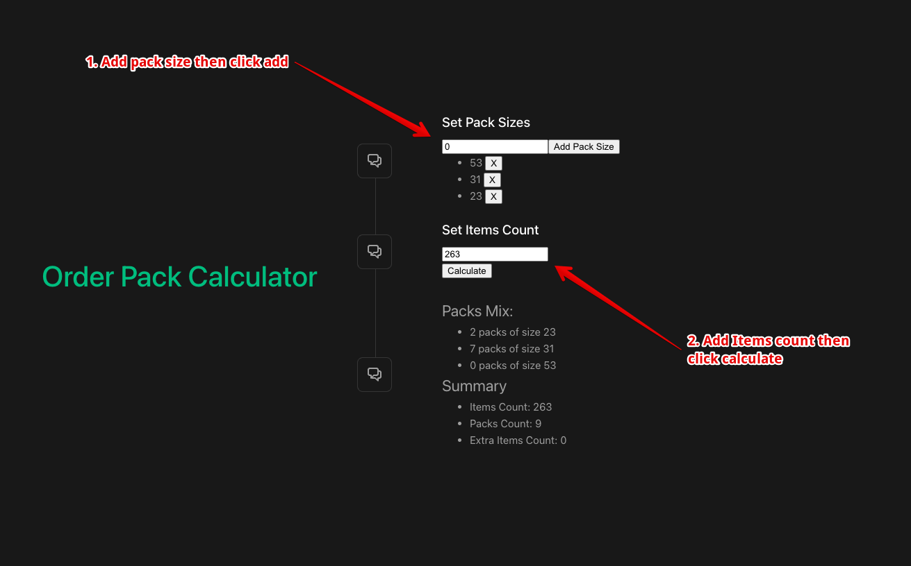

# Order-Pack-Calculator

## Description
This is a simple order pack calculator that takes in an order quantity and returns the number of packs required to fulfill the order. The calculator is designed to work with a predefined set of pack sizes and will return the most efficient combination of packs to fulfill the order.

## Run
To install the app, simply clone the repository and run the following command in the root directory:
```bash
$ docker-compose up
```
The app will be available at `http://localhost:4000`

## How to use

The app has a simple UI that allows you to enter the order quantity and view the number of packs required to fulfill the order. Simply enter the order quantity and click the "Calculate" button to view the result.